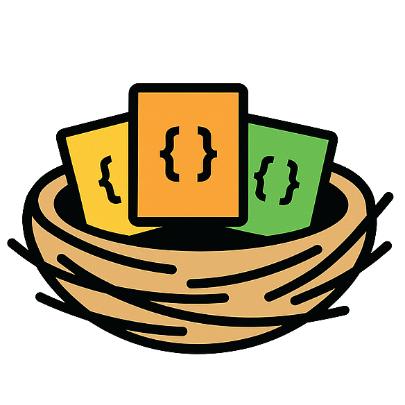

SchemaNest
===
[](https://github.com/timo-reymann/SchemaNest/blob/main/LICENSE)
[](https://app.circleci.com/pipelines/github/timo-reymann/SchemaNest)
[](https://github.com/timo-reymann/SchemaNest/releases)
[![Renovate](https://img.shields.io/badge/renovate-enabled-green?logo=data:image/svg+xml;base64,PHN2ZyB4bWxucz0iaHR0cDovL3d3dy53My5vcmcvMjAwMC9zdmciIHZpZXdCb3g9IjAgMCAzNjkgMzY5Ij48Y2lyY2xlIGN4PSIxODkuOSIgY3k9IjE5MC4yIiByPSIxODQuNSIgZmlsbD0iI2ZmZTQyZSIgdHJhbnNmb3JtPSJ0cmFuc2xhdGUoLTUgLTYpIi8+PHBhdGggZmlsbD0iIzhiYjViNSIgZD0iTTI1MSAyNTZsLTM4LTM4YTE3IDE3IDAgMDEwLTI0bDU2LTU2YzItMiAyLTYgMC03bC0yMC0yMWE1IDUgMCAwMC03IDBsLTEzIDEyLTktOCAxMy0xM2ExNyAxNyAwIDAxMjQgMGwyMSAyMWM3IDcgNyAxNyAwIDI0bC01NiA1N2E1IDUgMCAwMDAgN2wzOCAzOHoiLz48cGF0aCBmaWxsPSIjZDk1NjEyIiBkPSJNMzAwIDI4OGwtOCA4Yy00IDQtMTEgNC0xNiAwbC00Ni00NmMtNS01LTUtMTIgMC0xNmw4LThjNC00IDExLTQgMTUgMGw0NyA0N2M0IDQgNCAxMSAwIDE1eiIvPjxwYXRoIGZpbGw9IiMyNGJmYmUiIGQ9Ik04MSAxODVsMTgtMTggMTggMTgtMTggMTh6Ii8+PHBhdGggZmlsbD0iIzI1YzRjMyIgZD0iTTIyMCAxMDBsMjMgMjNjNCA0IDQgMTEgMCAxNkwxNDIgMjQwYy00IDQtMTEgNC0xNSAwbC0yNC0yNGMtNC00LTQtMTEgMC0xNWwxMDEtMTAxYzUtNSAxMi01IDE2IDB6Ii8+PHBhdGggZmlsbD0iIzFkZGVkZCIgZD0iTTk5IDE2N2wxOC0xOCAxOCAxOC0xOCAxOHoiLz48cGF0aCBmaWxsPSIjMDBhZmIzIiBkPSJNMjMwIDExMGwxMyAxM2M0IDQgNCAxMSAwIDE2TDE0MiAyNDBjLTQgNC0xMSA0LTE1IDBsLTEzLTEzYzQgNCAxMSA0IDE1IDBsMTAxLTEwMWM1LTUgNS0xMSAwLTE2eiIvPjxwYXRoIGZpbGw9IiMyNGJmYmUiIGQ9Ik0xMTYgMTQ5bDE4LTE4IDE4IDE4LTE4IDE4eiIvPjxwYXRoIGZpbGw9IiMxZGRlZGQiIGQ9Ik0xMzQgMTMxbDE4LTE4IDE4IDE4LTE4IDE4eiIvPjxwYXRoIGZpbGw9IiMxYmNmY2UiIGQ9Ik0xNTIgMTEzbDE4LTE4IDE4IDE4LTE4IDE4eiIvPjxwYXRoIGZpbGw9IiMyNGJmYmUiIGQ9Ik0xNzAgOTVsMTgtMTggMTggMTgtMTggMTh6Ii8+PHBhdGggZmlsbD0iIzFiY2ZjZSIgZD0iTTYzIDE2N2wxOC0xOCAxOCAxOC0xOCAxOHpNOTggMTMxbDE4LTE4IDE4IDE4LTE4IDE4eiIvPjxwYXRoIGZpbGw9IiMzNGVkZWIiIGQ9Ik0xMzQgOTVsMTgtMTggMTggMTgtMTggMTh6Ii8+PHBhdGggZmlsbD0iIzFiY2ZjZSIgZD0iTTE1MyA3OGwxOC0xOCAxOCAxOC0xOCAxOHoiLz48cGF0aCBmaWxsPSIjMzRlZGViIiBkPSJNODAgMTEzbDE4LTE3IDE4IDE3LTE4IDE4ek0xMzUgNjBsMTgtMTggMTggMTgtMTggMTh6Ii8+PHBhdGggZmlsbD0iIzk4ZWRlYiIgZD0iTTI3IDEzMWwxOC0xOCAxOCAxOC0xOCAxOHoiLz48cGF0aCBmaWxsPSIjYjUzZTAyIiBkPSJNMjg1IDI1OGw3IDdjNCA0IDQgMTEgMCAxNWwtOCA4Yy00IDQtMTEgNC0xNiAwbC02LTdjNCA1IDExIDUgMTUgMGw4LTdjNC01IDQtMTIgMC0xNnoiLz48cGF0aCBmaWxsPSIjOThlZGViIiBkPSJNODEgNzhsMTgtMTggMTggMTgtMTggMTh6Ii8+PHBhdGggZmlsbD0iIzAwYTNhMiIgZD0iTTIzNSAxMTVsOCA4YzQgNCA0IDExIDAgMTZMMTQyIDI0MGMtNCA0LTExIDQtMTUgMGwtOS05YzUgNSAxMiA1IDE2IDBsMTAxLTEwMWM0LTQgNC0xMSAwLTE1eiIvPjxwYXRoIGZpbGw9IiMzOWQ5ZDgiIGQ9Ik0yMjggMTA4bC04LThjLTQtNS0xMS01LTE2IDBMMTAzIDIwMWMtNCA0LTQgMTEgMCAxNWw4IDhjLTQtNC00LTExIDAtMTVsMTAxLTEwMWM1LTQgMTItNCAxNiAweiIvPjxwYXRoIGZpbGw9IiNhMzM5MDQiIGQ9Ik0yOTEgMjY0bDggOGM0IDQgNCAxMSAwIDE2bC04IDdjLTQgNS0xMSA1LTE1IDBsLTktOGM1IDUgMTIgNSAxNiAwbDgtOGM0LTQgNC0xMSAwLTE1eiIvPjxwYXRoIGZpbGw9IiNlYjZlMmQiIGQ9Ik0yNjAgMjMzbC00LTRjLTYtNi0xNy02LTIzIDAtNyA3LTcgMTcgMCAyNGw0IDRjLTQtNS00LTExIDAtMTZsOC04YzQtNCAxMS00IDE1IDB6Ii8+PHBhdGggZmlsbD0iIzEzYWNiZCIgZD0iTTEzNCAyNDhjLTQgMC04LTItMTEtNWwtMjMtMjNhMTYgMTYgMCAwMTAtMjNMMjAxIDk2YTE2IDE2IDAgMDEyMiAwbDI0IDI0YzYgNiA2IDE2IDAgMjJMMTQ2IDI0M2MtMyAzLTcgNS0xMiA1em03OC0xNDdsLTQgMi0xMDEgMTAxYTYgNiAwIDAwMCA5bDIzIDIzYTYgNiAwIDAwOSAwbDEwMS0xMDFhNiA2IDAgMDAwLTlsLTI0LTIzLTQtMnoiLz48cGF0aCBmaWxsPSIjYmY0NDA0IiBkPSJNMjg0IDMwNGMtNCAwLTgtMS0xMS00bC00Ny00N2MtNi02LTYtMTYgMC0yMmw4LThjNi02IDE2LTYgMjIgMGw0NyA0NmM2IDcgNiAxNyAwIDIzbC04IDhjLTMgMy03IDQtMTEgNHptLTM5LTc2Yy0xIDAtMyAwLTQgMmwtOCA3Yy0yIDMtMiA3IDAgOWw0NyA0N2E2IDYgMCAwMDkgMGw3LThjMy0yIDMtNiAwLTlsLTQ2LTQ2Yy0yLTItMy0yLTUtMnoiLz48L3N2Zz4=)](https://renovatebot.com)
[](https://pre-commit.com/)
[](https://codecov.io/gh/timo-reymann/SchemaNest)

<p align="center">
	
    <br />
    Where schemas grow, thrive, and scale with your team.
</p>

> This project is under active development.

## Features

- Supports uploading and versioning JSON schemas to a central repository.
- [TBD] Provides a web interface for browsing and searching schemas.
- CLI tool for uploading schemas from the command line.

## Requirements

- Postgres for production usage (SQLite is only recommended for evaluation and smaller instances)

## Installation

> tbd

## Usage

### CLI

```shell
schema-nest-cli --help
```

### Registry Server

```shell
# Spin up server on 0.0.0.0:8080
schema-nest-registry serve-http --port "8080"
```

## Motivation

Managing JSON Schemas is not rocket science. But every company I worked on had its own way of doing it. Some used a
simple file share, others had a complex setup with multiple repositories and CI/CD pipelines. I wanted to create a
solution that is straightforward to use, flexible, and can be adapted to any workflow.

There are already a few tools out there that do a great job at managing JSON schemas. But they are either too complex or
too resource-intensive for my needs. I wanted to create a tool that is easy to use, lightweight, and can be run on any
machine.

## Documentation

### API

The API definition is managed through OpenAPI 3.0, you can find an up-to-date spec in [openapi.yml](./openapi.yml).

For the [Redocly UI click here](https://timo-reymann.github.io/SchemaNest/apidocs.html). Please keep in mind that this
is always the latest development version.

Changes to the API are done when ever possible in a backward-compatible manner. So make sure your consuming code can
handle extra fields.

## Contributing

I love your input! I want to make contributing to this project as easy and transparent as possible, whether it's:

- Reporting a bug
- Discussing the current state of the configuration
- Submitting a fix
- Proposing new features
- Becoming a maintainer

To get started, please read the [Contribution Guidelines](./CONTRIBUTING.md).

## Development

### Requirements

- [GNU make](https://www.gnu.org/software/make/)
- [Go](https://go.dev/doc/install)
- [Docker](https://docs.docker.com/get-docker/)
- [pre-commit](https://pre-commit.com/)
- [Node.js](https://nodejs.org/en/download)
- [yarn](https://classic.yarnpkg.com/lang/en/docs/install/)

### Test

```sh
make test-coverage-report
```

### Build

```sh
make build
```

### Alternatives

- [Apicurio Registry](https://www.apicur.io/registry/)
    - Apicurio Registry is a runtime server system that stores a specific set of artifacts as files. Apicurio Registry
      enables you to add, update, and remove the artifacts from the store using a remote REST API.
- [Confluence Schema Registry (for Kafka)](https://github.com/confluentinc/schema-registry)
    - Confluent Schema Registry provides a serving layer for your metadata. It provides a RESTful interface for storing
      and retrieving your Avro®, JSON Schema, and Protobuf schemas. [...] 

